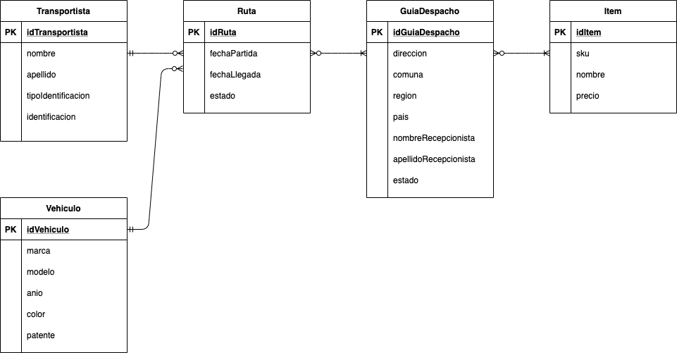

# Desafío

Crear una nueva aplicación con un esquema de negocio pequeño pero que deba contar con lo siguiente:

1. La aplicación debe ser de nivel 2, dada la arquitectura de los servicios REST
2. Al menos cumplir con un tipo de relación, ya sea OneToOne, OneToMany, ManyToOne o ManyToMany
3. Controller asociados a cada uno de los modelos
4. Interfaz genérica para el manejo de los métodos principales (C.R.U.D)
5. Cada modelo de negocio debe tener su propia clase de implementación
6. Utilizar el manejo de exception
7. Todos los controller deben devolver una respuesta tipo ResponseEntity

La tarea debe ser entregada a través de un repositorio git, tal como se había acordado previamente en clase

# Negocio utilizado

El negocio en el que quiero implementar básicamente todas mis tareas, y el proyecto final del curso, es un apoyo a una PYME de transportes, en donde uno de los principales dolores es la asignación y manejo de múltiples guías de despacho entre los conductores asignados.

Para esta tarea en particular me voy a centrar en las relaciones entre **Transportista - Vehículo - Ruta - Guía de Despacho**. 

## Model

El modelo se encuentra en formato Draw.io y se puede observar acá:

